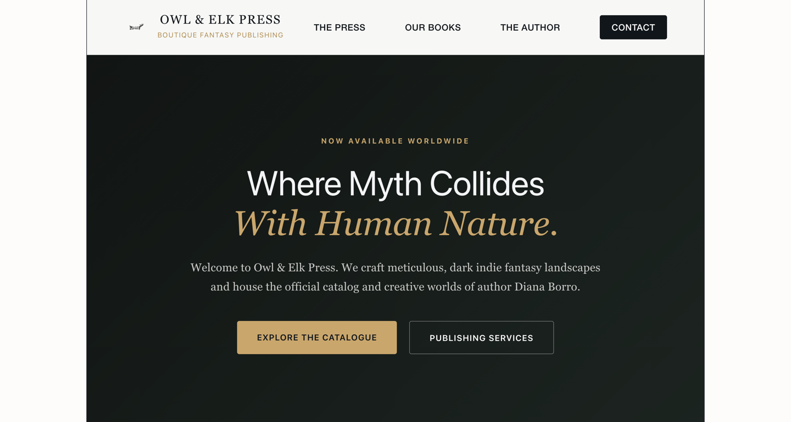
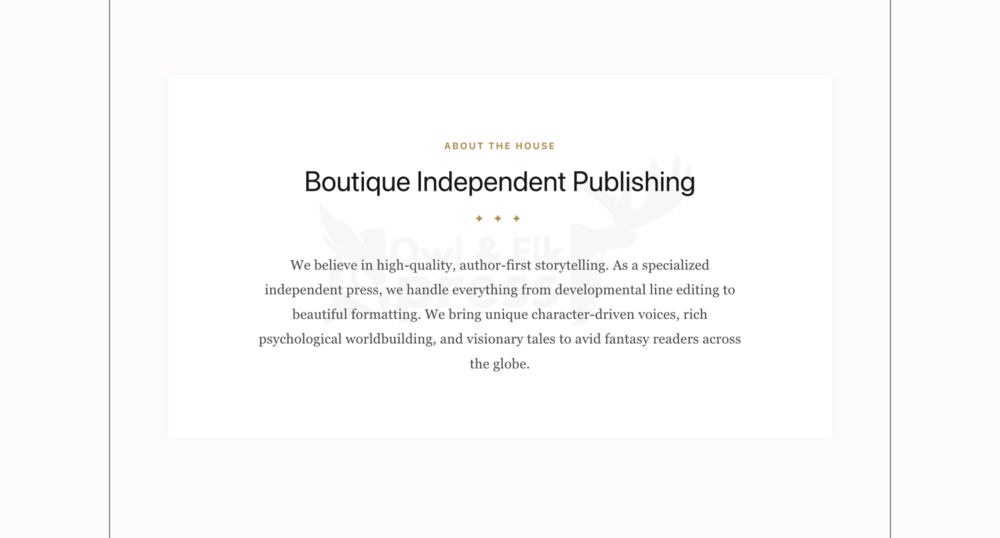
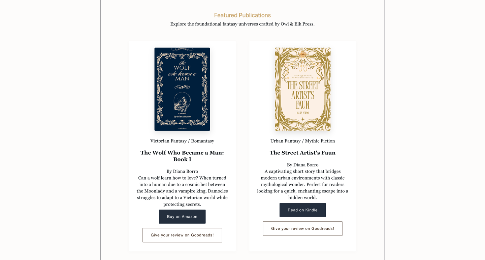
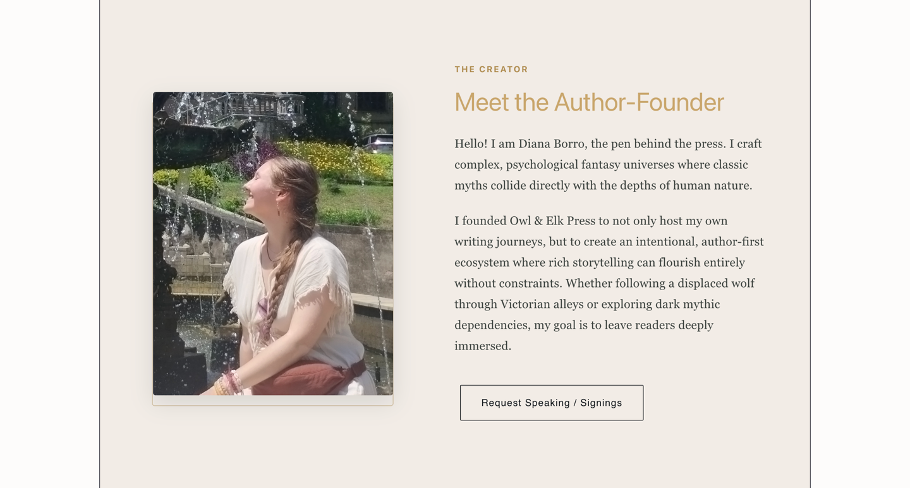

# 🦉 Owl & Elk Press 🦌

> Where Myth Collides With Human Nature.

A minimalist author website built with React, Vite, and TypeScript, 
and hosted globally via Firebase. Check it out!
https://owl-and-elk-press.web.app/
---

## 📺 Project Demos

| Desktop Walkthrough | Mobile Layout Tour |
| :---: | :---: |
| [](https://youtu.be) | [](https://youtube.com/shorts/xX1ZgOWN7Nk) |
| [Owl & Elk Press Website Demo](https://youtu.be) | [Owl & Elk Press Phone Demo](https://youtube.com/shorts/xX1ZgOWN7Nk) |

---

## 🎨 Screenshots & Interface

Here is a look inside the application layouts.

<p align="center">
  
  
</p>
<p align="center">
  
  
</p>

---

## 🚀 Key Features

* **Boutique Independent Publishing Showcase:** Highlighting deep, character-driven fiction stories.
* **Minimalist Design Language:** High-utility layout prioritizing content typography and reading comfort.
* **Optimized Deliverables:** Bundled swiftly via Vite and TypeScript for snappy performance.
* **Responsive Architecture:** Fully functional layout adapting to mobile and desktop displays.

---

## 🛠️ Tech Stack

* **Frontend:** React, TypeScript, Vite
* **Styling:** CSS Modules / Custom Properties
* **Hosting:** Firebase Hosting

---

## 💻 Local Installation & Setup

1. **Clone the repository:**
   ```bash
   git clone https://github.com
   cd owl-and-elk-press
   ```

2. **Install node dependencies:**
   ```bash
   npm install
   ```

3. **Start the development server local engine:**
   ```bash
   npm run dev
   ```

4. **Build and package for production deployment:**
   ```bash
   npm run build
   firebase deploy
   ```
